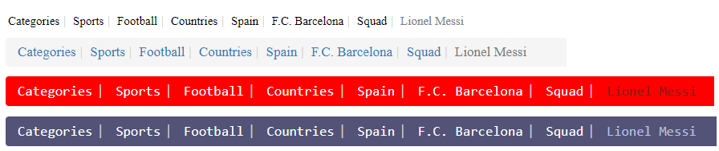

# ng-custom-breadcrumb


## Installation

In order to use library, you can import library in any Angular application by running:

```bash
$ npm install ng-custom-breadcrumb
```

and then from your Angular `AppModule`:

```typescript
import { BrowserModule } from '@angular/platform-browser';
import { NgModule } from '@angular/core';

import { AppComponent } from './app.component';

// Import the library
import { BreadcrumbModule } from 'ng-custom-breadcrumb';

@NgModule({
  declarations: [
    AppComponent
  ],
  imports: [
    BrowserModule,

    // Specify your library as an import
    BreadcrumbModule
  ],
  providers: [],
  bootstrap: [AppComponent]
})
export class AppModule { }
```

Once your library is imported, you can use it in your Angular application:

```xml
<!-- You can now use the library component in app.component.html -->
<breadcrumb-component [breadcrumbModel]="breadcrumbModel"></breadcrumb-component>
```

You can define breadcrumbModel in your .ts file like below:

```typescript
breadcrumbModel = {
    model: [
      { label: 'Categories', url: 'https://en.wikipedia.org/wiki/Lionel_Messi' },
      { label: 'Sports', url: 'https://en.wikipedia.org/wiki/Lionel_Messi' },
      { label: 'Football', url: 'https://en.wikipedia.org/wiki/Lionel_Messi' },
      { label: 'Countries', url: 'https://en.wikipedia.org/wiki/Lionel_Messi' },
      { label: 'Spain' },
      { label: 'F.C. Barcelona', url: 'https://en.wikipedia.org/wiki/Lionel_Messi' },
      { label: 'Squad', url: 'https://en.wikipedia.org/wiki/Lionel_Messi' },
      { label: 'Lionel Messi', url: 'https://en.wikipedia.org/wiki/Lionel_Messi' }
    ],
    style: { fontSize: "17px", bgColor: "#535377", passiveTextColor: "rgb(184, 194, 230)", activeTextColor: "white", fontFamily: "monospace" }
  };
```

| Property  |  Default |  Details |
|---|---|---|
|  model | null  |  model is an array of labels in breadcrumb.
| label  | null  | label is label for breadcrumb.   |
|  style |  null |  to create a new design, you can set style property.  |
|  fontSize |  null | to change the label's font size in breadcrumb. Same as css "font-size" property.   |
|  bgColor |  null | to change breadcrumb's background color. Same as css "background-color" property.  |
|  passiveTextColor |  null | to change last label's (current page label) text color in the breadcrumb. Same as css "color" property.  |
|  activeTextColor |  null |  to change all label's text color except last one (all previous page links) in the breadcrumb. Same as css "color" property.  |
|  fontFamily |  null | to change font family of labels. Same ass css "font-family" property.  |

## Sample Designs



